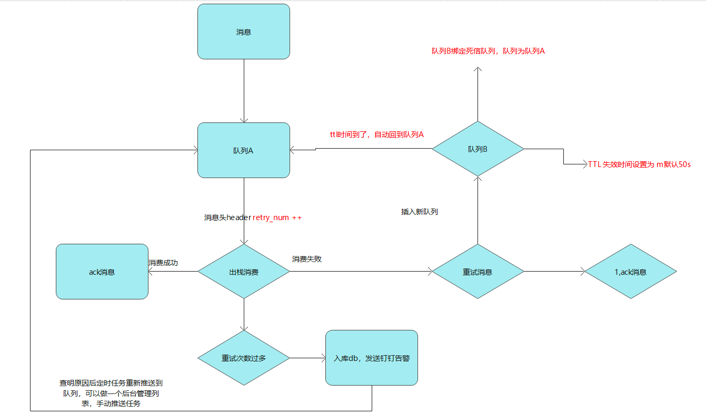

# mq
##消息队列

https://driverzhang.github.io/post/rabbitmq%E5%AE%9E%E6%88%98golang%E5%AE%9E%E7%8E%B0/

#### 重试队列逻辑
- 消息进入队列前，header默认有参数 x-retry=0 表示尝试次数；

- 消费者在消费时候的，如果消息失败，就把消息插入另外一个队列（重试队列abc）；该重试队列abc 绑定一个死信队列（原始消费的队列），这样形成一个回路；

- 当消息失败后，消息就进入重试队列abc，重试队列abc拥有ttl过期时间，ttl过期时间到了后，该消息进入死信队列（死信队列刚好是刚开始我们消费的队列）；

这样消息就又回到原始消费队列尾部了；

- 最后可以通过队列消息头部的header参数retry_num 可以控制消息消费多少次后，直接插入db日志；

- db日志可以记录交换机 路由，queuename，这样，可以做一个后台管理，可以手动一次把消息重新放入队列，进行消息（因为有时间消费队列里面可能在请求其它服务，其它服务也可能会挂掉）

这时候消息无论你消费多少次都没有用，但是入库db后，可以一键重回队列消息（当我们知道服务已经正常后）

